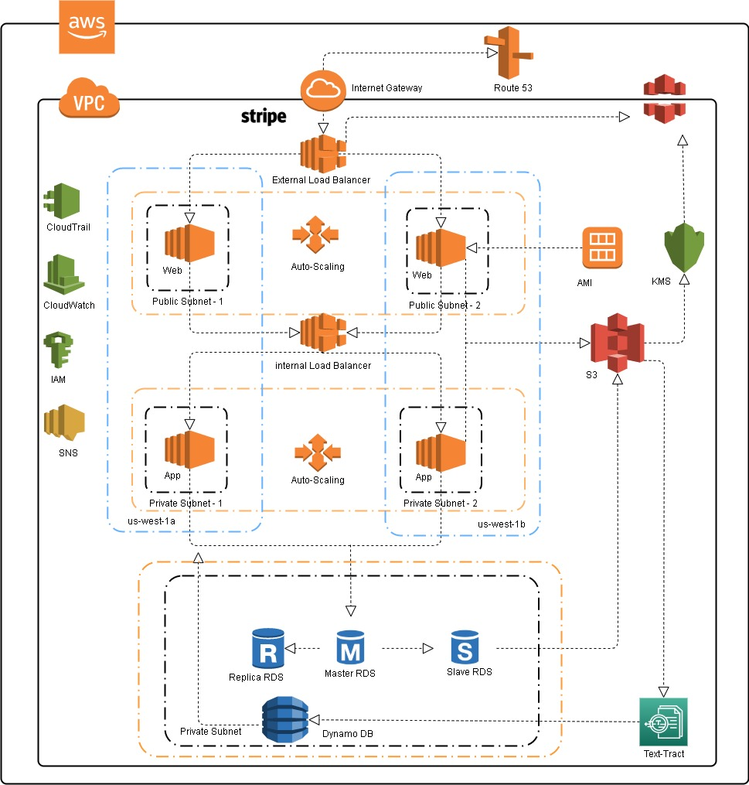

# AWS-Cloud-Architecture
Problem Statement: A Traditional IT infrastructure incapable to handle the predicted growth of a service provided by a medical startup company.

Overall Requirements and Assumptions

•	To make service available in United States, Europe and Asia Pacific regions.

•	Ability to run Development, Testing and Production environments.

•	Ability to provide a scalable software service.

•	To comply with legal and data regulatory compliance w.r.t. US, EU and APAC.

•	Ease of tracking the entire infrastructure’s activity.

•	To secure patient related sensitive information for ex. Health records.

•	To provide a secured payment gateway.

The Solution is to design the architeture by using the following services - 

	IAM (Identity and Access Management): Manages access to AWS resources and services by creating polices, roles and groups. Will be used to create roles and permissions as per requirement.

	SNS: Helps in delivering messages or sending alerts to doctors when the customer is requesting a service. 

	CloudWatch: Collects monitoring and operational data in form of logs, metrics and events to provide a unified view of AWS resources to detect anomalous behavior, set alarms, automated actions and troubleshoot. Important service to avoid downtime of the server.

	CloudTrail: Enables governance, compliance and auditing of AWS accounts. For ex. Log of each activity across AWS infrastructure to detect unusual activity and monitor AWS accounts.

	Route 53: A Cloud Domain system which routes the incoming traffic on basis of Latency, Failover, Geolocation to provide seamless customer service and routes the traffic based on the health of resources. For ex. Web servers. Helps in reachability of the company.

	Elastic Load Balancer: Distributes incoming traffic across multiple EC2 instances to make the service highly available. It will help reduce the lag for customers. 

	Auto-Scaling Group: Automatically monitors and adjusts computing resources to maintain steady performance at the lowest possible cost. It will help provide bandwidth during peak hours.

	CloudFront: Helps to speed up the static and dynamic content of the application with high data transfer speed and low latency.  

	Amazon Machine Image (AMI): Provides image file of instances to Auto-Scaling group for scalability. 

	Relational Databases: To store the data entered by the customer in Master-Slave format with a Replica.

	S3 (Simple Storage Service): Provides scalable, high-speed web-based storage service. Helpful in storing instance snapshots and uploaded documents, images by the customer.

	Dynamo DB: To store the name of medicines extracted from the uploaded documents.

	Text-Tract: Use to scan the documents uploaded by the customer to extract text i.e. medicines.

	KMS (Key Management Service): Helps to create, store and control encryption keys to encrypt data.

	Stripe: Provides a secured payment gateway for customers to pay for the service used. 

